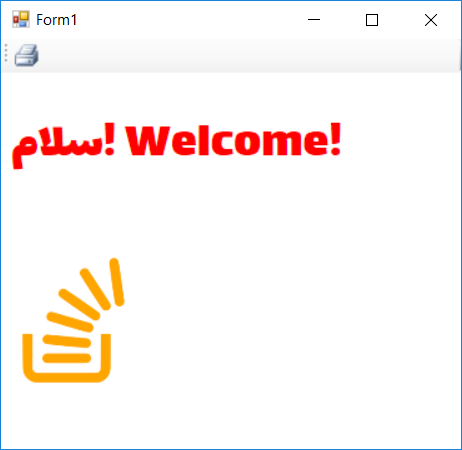
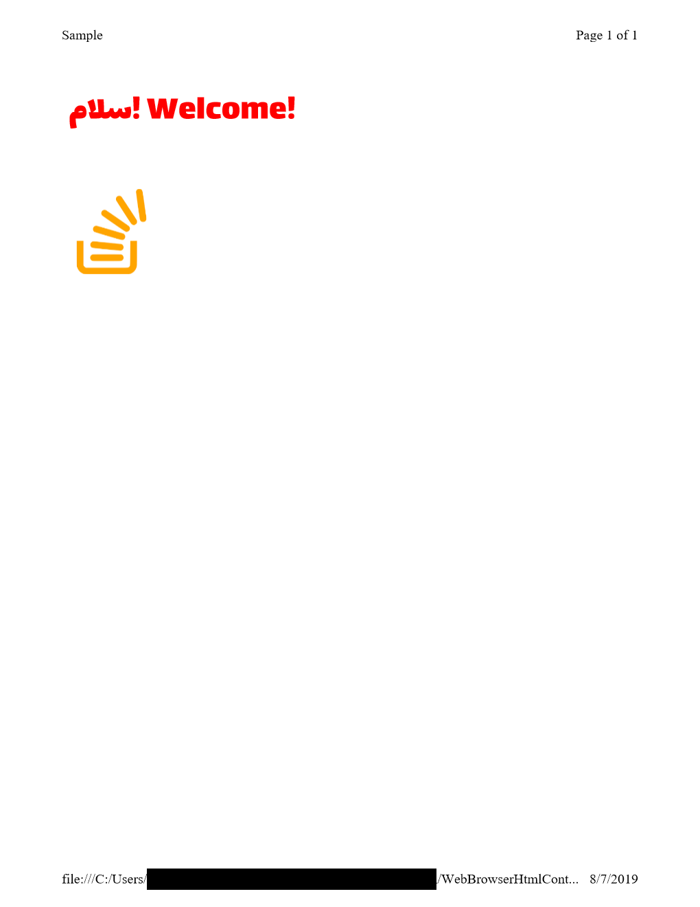

# Set base URL for HTML contents - resolve relative URLs

Sometimes you want to set `DocumentText` of `Browser` control without loading any URL. In this case, if you have some relative URLs in the html content, like image, css or font, thery will not load.

In this example I'l show how you can set the base URL for html contents to resolve relative URLs.

> **Important Debug Note**: To debug the application, disable `NotImplementedException` by going to Debug menu → Windows → Exception Settings → Search for System.NotImplementedException→ Clear the checkmark. Or if it throws exception, you can uncheck the exception in the exception window.
> If you press <kbd>Ctrl</kbd>+<kbd>F5</kbd> you should not see any exception.

You can implement `IMoniker` interface and providing non-trivial implementation just for `GetDisplayName` and `BindToStorage`. Then using `IWebBrowser2` from `SHDocVw` you can load the document and set a base url for that.

Her I've created an extension method for `WebBrowser` control having the following method:

* `void SetHtmlContent(string html, string baseUrl)`

With these parameters:

* `html`: HTML content to load in web browser
* `baseUrl`: Base url to use for the document. It will be used like a real Url for resolving relative addresses.

You can easily use it like this:

    webBrowser1.SetHtmlContent(html, $@"{new Uri(Application.StartupPath)}/");

Just add a reference to `SHDocVw` and add the `WebBrowserExtensions` class to your project.

And here is the screenshot for the print into OneNote printer:

